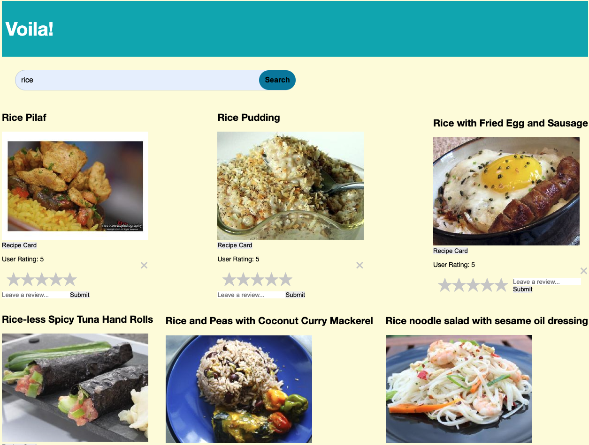

# Voila Chef 

## Description

A food recipe app that lets you search for any meal/food type. Built with vanilla JS frontend and spoonacular API. 

## Project Details

- Created a single page functionality to display meals and make customized food queries 
- Used spoonacular complex API to render client side information
- Used custom vanilla CSS and JavaScript to style Application

See Environment Setup below for instructions on installing these tools if you
don't already have them.

## Languages Used

JavaScript
HTML5
CSS3

## App preview

